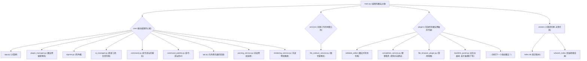

# EvoNote - 你的可进化知识与自动化伙伴 🚀

[](https://opensource.org/licenses/MIT)

欢迎来到 EvoNote 的魔法世界！✨

请忘记那些功能固定的冰冷工具，把 EvoNote 想象成一个能与你一同成长、不断“进化”的魔法伙伴。

它不仅仅是一个笔记软件，更是一个以 **Markdown + Python** 为核心咒语，拥有无限可能性的个人知识与自动化城堡。在这里，**你的想象力是魔法的唯一边界**。

---

## 🧠 EvoNote的哲学：数据永生，功能自由

你是否曾被某个笔记软件“绑架”？你的奇思妙想被锁在特定的格式里，强大的功能却总差那么一点点，无法完全满足你的需求。

EvoNote 为此而生，它的哲学很简单：

- **✍️ Markdown · 永恒的知识羊皮卷**
  EvoNote 相信，笔记是思想的沉淀，它应该像古老的羊皮卷一样，属于你并流传百年。因此，它选择 `Markdown` 这种开放、人类可读的纯文本格式。无论未来世界如何变迁，你的知识永远清晰、可控、属于你。

- **🐍 Python · 自由的功能魔法棒**
  EvoNote 相信，最懂你的魔法师就是你自己。因此，它选择 `Python` 这个强大、易学且拥有无限生态的语言作为你的“魔法棒”。在 EvoNote 中，**每一个功能都是一个独立的 Python 魔法卷轴（插件）**。你可以像拼乐高一样，自由组合、修改，甚至用几行 Python 代码（或者让 AI 帮你写！）创造一个全新的魔法，打造一个完全为你定制的专属城堡。

---

## ✨ 核心优势：为什么EvoNote与众不同？

- **🚀 无限扩展，随你进化**
  EvoNote 的心脏是一个极简的“魔法核心”，所有的功能都由可插拔的“魔法卷轴”（插件）提供。无论是翻译工具、数据图表，还是 AI 助手，你都可以轻松地为它增添新的魔法。

- **🕊️ 告别锁定，数据自由**
  你的所有笔记都是标准的 `.md` 羊皮卷，安稳地存放在你自己的“领地”（电脑）上。没有专有格式，没有云端束缚。你可以随时用任何工具打开、传承你的知识。

- **🧩 极致解耦，稳定灵活**
  在城堡里，所有“魔法卷轴”都通过一个“传声螺”（全局信号总线）来沟通，彼此保持独立。这意味着你可以随意增删魔法，而不用担心城堡会塌方。这赋予了 EvoNote 极高的稳定性和灵活性。

- **🤖 AI 友好，拥抱未来**
  Python 是 AI 时代的通用咒语。这意味着你可以轻松地将各种强大的 AI 魔法（如 GPT、Gemini 等）在不懂任何编程的情况下就做一个插件集成到你的笔记工作流中，让你的知识库真正“活”起来。（后边我会出教程）

---

## 🚀 快速上手：开启你的魔法之旅

准备好了吗，冒险者？只需两步，就能进入 EvoNote 的世界：

**1) 念动咒语（安装依赖）**
```bash
pip install -r requirements.tx
```

**2) 开启传送门（运行 EvoNote）**
```bash
python main.py
```

> 💡 **小提示**: 首次进入时，你的领地里会出现一个叫 `.enotes` 的小精灵小屋，里面住着你的知识管家（数据库）和图书管理员（索引）。它已经被施了“隐身术”（加入了 .gitignore），你无需在意它。

---

## 🎮 新手任务：像玩游戏一样探索 EvoNote

欢迎来到新手村！让我们通过几个小任务，解锁 EvoNote 的基本玩法吧！

### 任务一：召唤“命令圣坛”

在任何地方，按下 `Ctrl+P`（苹果电脑是 `Cmd+P`），你会召唤出一个悬浮的“命令圣坛”。这里是所有快捷魔法的入口。

- **试试看**：在圣坛里输入“新建”，你会看到“文件：新建笔记”的选项，回车就能创造一张新的羊皮卷！

### 任务二：建立知识传送门

知识不应该是孤岛。在 EvoNote 里，你可以轻松地将它们连接起来。

- **试试看**：
  1.  我们已经为你准备了 `Note A.md` 和 `Note B.md` 两张羊皮卷。
  2.  打开 `Note A.md`，在里面输入 `[[Note B]]`。
  3.  看！`[[Note B]]` 是不是变成了蓝色还带下划线？把鼠标放上去，光标会变成小手，**点击它**！你会瞬间被传送到 `Note B.md`！
  4.  当你输入 `[[No` 的时候，聪明的图书管理员还会弹出提示，帮你补全笔记名哦！

### 任务三：创造可复用的“知识结晶”

有些知识或想法，你可能会在很多地方重复使用。把它们变成“知识结晶”吧！

- **试试看**：
  1.  在 `Note A.md` 里，输入 `{{这是一个重要的想法}}`。这个想法就被提炼成了一块独一无二的“知识结晶”。
  2.  现在，去 `Note B.md`，尝试输入 `{{这是`，补全列表是不是出现了？选择它，这块“结晶”就被完美地复用了！

恭喜你，新手任务完成！你已经掌握了在 EvoNote 世界里穿梭和创造的基本技能！

---

## 🛠️ 进阶魔法：如何创造你自己的“魔法卷轴”（插件编写）？

想为 EvoNote 添加一个新魔法？你只需要创造一个 Python 魔法卷轴！

例如，我们来写一个点击菜单栏就打印 "Hello!" 的魔法 `hello_plugin.py`：

```python
# plugins/hello_plugin.py

from PySide6.QtWidgets import QMenu
from PySide6.QtGui import QAction

# 1. 定义一个魔法师类
class HelloPlugin:
    def __init__(self, app_context):
        self.app_context = app_context
        self.main_window = app_context.ui_manager.main_window

        # 2. 找到城堡的菜单栏，添加一个新魔法
        menu = self.main_window.menuBar().addMenu("Hello")
        action = QAction("Say Hello", self.main_window)
        action.triggered.connect(self.say_hello)
        menu.addAction(action)

    def say_hello(self):
        print("Hello! This is your first magic!")

# 3. 告诉 EvoNote 如何召唤你的魔法师
def create_plugin(app):
    return HelloPlugin(app.app_context)
```

把它放进 `plugins` 文件夹，重启 EvoNote，你就会在菜单栏看到 "Hello" 选项。看，你已经是一个魔法师了！

---

## 🗺️ 城堡结构导览

想深入探索 EvoNote 城堡的内部构造吗？这份地图将指引你：



---

## 📜 历史的篇章 (更新日志)

- **V0.4.4 (2025-10-02) - 知识结晶**: 引入了 `{{内容块}}` 的魔法，实现了后台索引和实时补全。
- **V0.4.3 (2025-10-02) - 命令圣坛**: 加入了 `Ctrl+P` 命令面板，让操作像大法师一样迅捷。
- **V0.4.2b (2025-10-02) - 记忆水晶球**: 新增右侧“反向链接”面板，可查看哪些笔记链接到了当前笔记。
- **V0.4.2a (2025-10-02) - 传送门激活**: 编辑器内的 `[[页面链接]]` 变得可以点击，实现了笔记间的快速传送。
- **V0.4.1 (2025-10-02) - 智慧的低语**: 在输入 `[[` 时，智慧精灵会低语提示，帮��自动补全笔记标题。
- **V0.4.0.1 (2025-10-02) - 地基加固**: 修复了图书管理员的多个bug，重构了重命名逻辑，让知识库更稳固。
- **V0.3.2 (2025-10-01) - 羽毛笔升级**: 编辑器内核全面升级，书写体验如丝般顺滑。
- **V0.3.1 (2025-10-01) - 羊皮卷显影**: 实现了基于 AST 的 Markdown 只读渲染，让文字有了样式。
- **V0.3.0 (2025-10-01) - 获得阅读能力**: 成功集成了 `markdown-it-py` 解析库，让城堡能读懂 Markdown。
- **V0.2 (2025-10-01) - 城堡骨架**: 实现了完全由插件驱动的动态停靠 UI 系统。
- **V0.1 (2025-09-30) - 创世之初**: 建立了基于微内核 + 插件的最小可行城堡。

---

## 🚀 未来的史诗 (路线图)

- **V0.4.5 (拟): 知识结晶的共鸣**
  实现“知识结晶”的同步修改，当一块结晶变化时，所有复用它的地方都会产生共鸣，同步更新。
- **V0.5.0 (拟): 魔法咒语增强**
  提供更强大、更易用的魔法棒（Python API），让你能更轻松地创造毁天灭地的强大魔法。
- **长远的目标**:
  - 建立一个伟大的魔法师联盟（插件社区）。
  - 召唤强大的 AI 仆从，实现智能摘要、问答和自动化整理。
  - 探索这个世界的无限可能性...

---

## 📄 联盟契约 (许可协议)

本项目采用 **MIT License**。欢迎你自由地使用、传承和创造。
