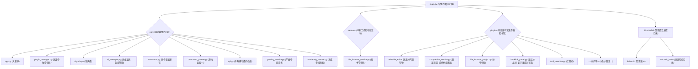

🚧 注意该项目还在施工中现在不可用 🚧


# EvoNote - 你的可进化知识与自动化伙伴 🚀

[](https://opensource.org/licenses/MIT)

欢迎来到 EvoNote 的魔法世界！✨

请忘记那些功能固定的冰冷工具，把 EvoNote 想象成一个能与你一同成长、不断“进化”的魔法伙伴。

它不仅仅是一个笔记软件，更是一个以 Markdown + Python 为核心咒语，拥有无限可能性的个人知识与自动化城堡。在这里，你的想象力是魔法的唯一边界。

---

## 🧠 EvoNote 的哲学：数据永生，功能自由

- ✍️ Markdown · 永恒的知识羊皮卷  
  EvoNote 相信，笔记是思想的沉淀，它应该像古老的羊皮卷一样，属于你并流传百年。因此，它选择 Markdown 这种开放、人类可读的纯文本格式。无论未来世界如何变迁，你的知识永远清晰、可控、属于你。

- 🐍 Python · 自由的功能魔法棒  
  EvoNote 相信，最懂你的魔法师就是你自己。因此，它选择 Python 这个强大、易学且拥有无限生态的语言作为你的“魔法棒”。在 EvoNote 中，每一个功能都是一个独立的 Python 魔法卷轴（插件）。你可以像拼乐高一样，自由组合、修改，甚至用几行 Python 代码（或者让 AI 帮你写！）创造一个全新的魔法，打造一个完全为你定制的专属城堡。

---

## ✨ 核心优势：为什么 EvoNote 与众不同？

- 🚀 无限扩展，随你进化  
  核心极简，功能皆为可插拔插件。你可以为它增添翻译、图表、AI 助手等任意“魔法”。

- 🕊️ 告别锁定，数据自由  
  所有笔记均为标准 .md 纯文本，完全掌握在你本地手中。

- 🧩 极致解耦，稳定灵活  
  插件通过全局信号总线解耦，彼此独立、安全稳定。

- 🤖 AI 友好，拥抱未来  
  Python 是 AI 时代的通用咒语，轻松把各类 AI 能力集成进你的知识工作流。

---

## 🚀 快速上手：开启你的魔法之旅

只需两步：

1) 念动咒语（安装依赖）
```bash
pip install -r requirements.txt
```

2) 开启传送门（运行 EvoNote）
```bash
python main.py
```

提示

- 首次进入若未选择任何“知识库（Vault）”，界面会显示欢迎语并禁用编辑。  
  请通过“工具栏 → 库管理”添加或切换一个库后再开始书写。
- 安全规则：禁止将“程序目录（EvoNote 安装目录）”设置为库；请选择任意你自己的文件夹作为库根目录。
- 库结构会在创建/切换时自动生成：
  - pages/：存放你的 Markdown 笔记
  - assets/：存放图片等附件
  - .EvoNotDB/：库数据库目录（包含 whoosh_index 与 index.db），已加入 .gitignore

---

## 🎮 新手任务：像玩游戏一样探索 EvoNote

欢迎来到新手村！通过几个小任务，快速掌握基本玩法。

### 任务一：召唤命令面板

在任何地方按下 Ctrl+P（macOS 为 Cmd+P），会召唤“命令面板”。这里是所有快捷魔法的入口。

- 试试看：在面板中输入“新建”，选择“文件：新建笔记”即可创建一张新的羊皮卷。

### 任务二：建立知识传送门（链接）

知识不应是孤岛，你可以用 [[页面链接]] 在笔记之间穿梭。

- 我们已为你准备了 Note A.md 与 Note B.md。打开 Note A.md，输入 [[Note B]]。  
  你会看到蓝色带下划线的链接，点击即可跳转。现在链接文本不展示 .md 后缀，补全候选也只显示“笔记名”（stem）。

- Shift+点击 [[Note B]] 可在“新窗口”中打开该笔记的独立编辑器，窗口标题即为“Note B”。  
  新窗口之间互不干扰，便于并行对照编辑。

- 若输入 [[New Note]] 并点击它（或从补全中选择后回车），系统会在当前库的 pages/ 下自动创建 pages/New Note.md，并跳转或在新窗打开（按 Shift）。

- 在输入 [[No 时，补全会基于 SQLite 的 files.stem 前缀匹配提供候选项；列表中不显示 .md。

### 任务三：创造可复用的知识结晶（内容块）

- 在 Note A.md 输入 {{这是一个重要的想法}}。  
- 当你停止输入约 250ms 后，会出现半透明浮窗，提供“全局更新/取消”操作：  
  - 全局更新：把该块在其它文件中的实例同步为当前内容  
  - 取消：撤销这次块级修改并恢复
- 在 Note B.md 输入 {{这是 开头，补全会出现同名块，选择即可复用。

---

## 🧭 库管理（工具栏）

- 打开“工具栏 → 库管理”，你可以：  
  - 添加库：选择任意文件夹作为库根目录  
  - 切换库：一键切换当前工作库，应用会自动确保 pages/ 与 assets/ 存在  
  - 移除库：可移除非当前库的记录  
  - 清空并重建索引：删除并重建 .EvoNotDB（index.db、whoosh_index）  

切换库后，应用会更新上下文并广播状态；若无库处于激活状态，将回到“无库态欢迎语”，并拦截跳转/新窗等操作。

---

## 🗺️ 城堡结构导览



---

## 📜 历史的篇章（更新日志）
- V0.4.5b: 新增了带前进/后退功能的导航工具栏，并实现了笔记重命名与全库链接同步；同时修复了浮动窗口无法保存和{{输入不稳定的核心BUG，加入了全局自动保存，大幅提升了应用的稳定性和专业性。
- V0.4.5a: 这是一个关键的修复与增强版本。它彻底修复了 [[页面链接]] 的导航跳转和 {{内容块}} 的同步BUG；同时，引入了全新的“多库（Vault）管理”系统，支持创建、切换和管理多个独立的知识库。
- V0.4.5: 实现了完整的 {{内容块}} 同步修改引擎，包括修改后的UI提示、后台异步全局更新、智能合并及垃圾回收功能。
- V0.4.4 (2025-10-02) - 知识结晶：引入 {{内容块}}，实现后台索引与实时补全
- V0.4.3 (2025-10-02) - 命令面板：加入 Ctrl+P 命令面板
- V0.4.2b (2025-10-02) - 反向链接面板：查看哪些笔记提到了当前笔记
- V0.4.2a (2025-10-02) - 链接点击：编辑器内 [[页面链接]] 可点击跳转
- V0.4.1 (2025-10-02) - 智慧的低语：在输入 [[ 时提供自动补全
- V0.4.0.1 (2025-10-02) - 地基加固：修复图书管理员多个问题，重构重命名逻辑
- V0.3.2 (2025-10-01) - 羽毛笔升级：编辑器内核升级，书写体验更流畅
- V0.3.1 (2025-10-01) - 羊皮卷显影：基于 AST 的 Markdown 只读渲染
- V0.3.0 (2025-10-01) - 获得阅读能力：集成 markdown-it-py 解析
- V0.2 (2025-10-01) - 城堡骨架：可停靠的插件式 UI 系统
- V0.1 (2025-09-30) - 创世之初：微内核 + 插件的最小可行城堡

---

## 🚀 未来的史诗（路线图）

- V0.4.6（拟）：知识结晶的进一步共鸣  
  - 更细粒度的冲突合并与版本回溯
- V0.5.0（拟）：Python API 增强  
  - 更强大、更易用的插件与自动化能力
- 长远目标：  
  - 建立开放的插件生态  
  - 引入更强 AI 能力（摘要、问答、自动整理）  
  - 探索更多可能性

---

## 📄 许可协议

本项目采用 MIT License。欢迎自由使用、传承与创造。

## 🆕 V0.4.5b 速览与用法

本版本聚焦“常用按键导航栏/历史”“窗口管理一致性（Shift+点击浮动Dock）”“编辑器标题与重命名（全库同步）”“输入稳定性与自动保存”“库管理防御”。以下为核心功能与操作指南。

### 导航工具栏（后退/前进 + 历史）
- 显示位置：主窗口顶部（可拖到左侧/右侧/底部，亦可浮动）。
- 功能：
  - “后退/前进”与“历史记录”联动，自动启用/禁用。
  - 历史仅记录用户在主编辑器内的正常跳转；初始程序性广播与 Shift+新窗不入栈。
- 自定义顺序（拖拽自排序）：
  - 用鼠标按住工具栏上的“后退/前进”按钮左右拖动，即可交换顺序。
  - 顺序持久化到配置（ui.toolbar_actions），重启后生效。
- 调整历史长度：
  - 修改配置 ui.nav_history_maxlen（默认 50），重启后历史最大容量按新值生效。

提示：导航快捷入口来自“导航工具栏”插件，历史服务独立运行，按钮与历史状态通过全局信号自动联动。

### Shift+点击 → 浮动 QDockWidget（可停靠/可组合）
- 在编辑器内按住 Shift 点击 [[页面]]，将在主界面内弹出一个“浮动”的编辑器窗体（QDockWidget）。
- 你可以拖动该窗体到主界面任意边停靠，或继续浮动。
- 浮动窗与主编辑器行为一致：支持跳转、补全、自动保存、标题与重命名等。

### 编辑器 Dock 标题自动更新与重命名（全库同步）
- 自动更新：当编辑器加载某个笔记后，其所属 Dock 标题自动更新为该笔记名（不含 .md）。
- 重命名：
  - 双击 Dock 标题或在编辑器中按 F2 进入编辑态，输入新名字并回车。
  - 系统会将该 .md 文件在磁盘上重命名，并执行“全库引用同步”：
    - 所有 [[旧名]]、[[旧名#锚点]]、[[旧名|别名]]、[[pages/旧名]] 形式将替换为新名，尾部的 #锚点 与 |别名 原样保留。
  - 完成后会刷新索引（Whoosh + SQLite），使补全与反链保持一致。

注意：若新名非法（含路径分隔符/特殊字符等）或与现有文件重名，将拒绝提交；不会破坏现有文档。

### 自动保存（防抖 + 原子写 + upsert）
- 当停止输入约 800ms 后，编辑器会自动保存当前笔记：
  - 采用“原子写入”策略，避免半写入造成的数据损坏；
  - 保存成功后会向索引队列投递 upsert 刷新索引；
  - 若内容未变化，不会重复写盘。
- 该逻辑同时适用于主编辑器与浮动 Dock。

### {{ 输入稳健性（不再清空文档）
- 针对 {{12、{{ 等特殊输入场景，编辑器进行了全面加固，任何情况下都不会因补全/解析失败而清空文档。
- 补全弹窗异常只会“隐藏弹窗”，不会影响文档内容。

### 库管理防御：当前库不可移除
- 工具栏 → 库管理：
  - 当前激活库（★）的“移除”按钮为禁用状态；
  - 配置层防御同时生效：即使通过其它调用路径尝试移除当前库，也会被拒绝并记录警告。
- 添加/切换库时，系统会自动确保库的 pages/ 与 assets/ 目录存在。

---

## 🧭 快速操作清单（V0.4.5b）

- 导航历史：依次跳转 A → B → C，点击“后退”两次回到 A（按钮变灰），再“前进”回到 B。
- 浮动窗：在 A 中 Shift+点击 [[B]] 弹出“B”的浮动窗，拖入右侧停靠，再拖出为浮动。
- 自动保存：在任一编辑器输入并停顿 ~0.8s，文件变更落盘且索引更新（终端可见 upsert 日志）。
- 重命名：双击标题改名为“Note A Renamed”，稍后全库 [[Note A]] 变为 [[Note A Renamed]]（锚点/别名保留）。
- 稳健性：快速输入 {{12、{{ 等，文档不会被清空。
- 库管理：可添加/切换库；尝试移除当前库会被拒绝（UI 禁用 + 配置防御）。

---

## 📝 更新日志补充
- V0.4.5b:
  - 新增“导航工具栏”（后退/前进），按钮拖拽自排序并持久化；
  - 导航历史服务：仅记录有效跳转，边界状态自动联动；
  - Shift+点击 [[页面]] → 浮动 QDockWidget，可停靠/可组合；
  - 编辑器 Dock 标题自动更新与“双击重命名”（全库 [[旧名]]→[[新名]] 同步）；
  - 自动保存：~800ms 防抖，原子写入，保存后索引 upsert；
  - {{ 输入稳健性加固：极端输入不清空文档；
  - 库管理防御：禁止移除当前激活库（UI/配置双重防御）。
