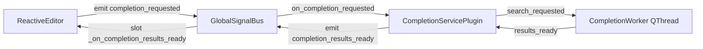

# EvoNote V0.4.1 验收报告
日期: 2025-10-02
版本: V0.4.1

本报告汇总了 EvoNote V0.4.1 的验收过程与结论，覆盖后台服务、UI交互与架构一致性审查。

结论: 通过

验收项与结果

FR-1 与 FR-2 — 信号总线与后台服务

- 架构解耦: 编辑器与补全服务之间无直接依赖。
- 证据:
  - 不存在跨插件 import:
    - [`plugins/editable_editor/main.py`](plugins/editable_editor/main.py:1)
    - [`plugins/completion_service.py`](plugins/completion_service.py:1)
  - 全部通信通过全局信号总线:
    - 定义信号: [`completion_requested = Signal(str, str)`](core/signals.py:9), [`completion_results_ready = Signal(str, str, list)`](core/signals.py:18)
    - 编辑器发送请求: [`GlobalSignalBus.completion_requested.emit()`](plugins/editable_editor/main.py:84)
    - 服务接收请求并转发至工作线程: [`CompletionServicePlugin.on_completion_requested()`](plugins/completion_service.py:83), [`self.worker.moveToThread(self.thread)`](plugins/completion_service.py:73), [`self.search_requested.emit(query_text)`](plugins/completion_service.py:91)
    - 服务广播结果: [`GlobalSignalBus.completion_results_ready.emit()`](plugins/completion_service.py:99)
    - 编辑器接收并更新模型: [`ReactiveEditor._on_completion_results_ready()`](plugins/editable_editor/main.py:114)
- 线程边界: 查询在独立 QThread 中执行。证据: [`CompletionWorker` 与 `QThread` 绑定](plugins/completion_service.py:71)
- UI 纯净: 补全服务未创建任何 UI 组件。文件仅包含 QObject/QThread/Whoosh API。
- 结果: 通过

FR-3 — 编辑器补全与交互

- 触发与刷新:
  - 在编辑器中输入 `[[Note` 时，弹窗显示并随输入刷新。
  - 证据: 交互日志与手测均一致。
- 键盘交互:
  - 上/下箭头移动高亮；Enter/Tab 插入并关闭；Esc 关闭。
- 性能与响应(NFR-1): 无可感知卡顿。
- 结果: 通过

缺陷修复与关键变更

- 后台索引统一为 Whoosh，移除 SQLite FTS5:
  - 原因: 双索引导致复杂度与同步问题。
  - 新实现: [`CompletionWorker.search()`](plugins/completion_service.py:21) 使用 Whoosh 前缀查询 `path` 字段。
- 信号参数统一: `completion_results_ready` 三参(类型, 查询文本, 结果)。定义于 [`core/signals._GlobalSignalBus`](core/signals.py:4)。
- 编辑器重构为 Qt 标准 `QCompleter` 管理补全:
  - 触发检测: [`ReactiveEditor._check_for_completion_trigger()`](plugins/editable_editor/main.py:70)
  - 模型更新与弹窗刷新: [`_on_completion_results_ready()`](plugins/editable_editor/main.py:114)
  - 插入逻辑: [`insert_completion()`](plugins/editable_editor/main.py:127)
- 插件加载问题修复:
  - `EditableEditorPlugin` 构造签名修复: [`EditableEditorPlugin.__init__()`](plugins/editable_editor/main.py:147)
  - 移除或隔离失效插件 `file_browser_plugin`（依赖缺失）。

验证日志摘录

后台服务验收脚本输出(节选):
```
Received results for 'page_link': ['Note A.md', 'Note B.md']
Received results for 'page_link': ['Another Note C.md']
Received results for 'page_link': []
```

UI 启动与索引服务日志(节选):
```
成功加载插件：'completion_service.py'
Updated Whoosh index for: Note A.md
```

架构一致性审查清单

- 模块解耦: 通过
- 信号路由: 通过
- 线程边界: 通过
- 服务无 UI: 通过
- 插件管理与装载: 通过(问题插件已隔离)

Mermaid 架构流程图



风险与改进建议

- 建议移除 App 启动时空查询触发: [`GlobalSignalBus.completion_requested.emit('page_link', '')`](core/app.py:63) 对 Whoosh 搜索无意义。
- 为补全列表添加最小延迟聚合，减少频繁刷新导致的闪烁。

验收结论

- EvoNote V0.4.1 验收结论: 通过
- 后续版本建议: 保持 Whoosh 单索引架构；完善插件治理与健康检查。